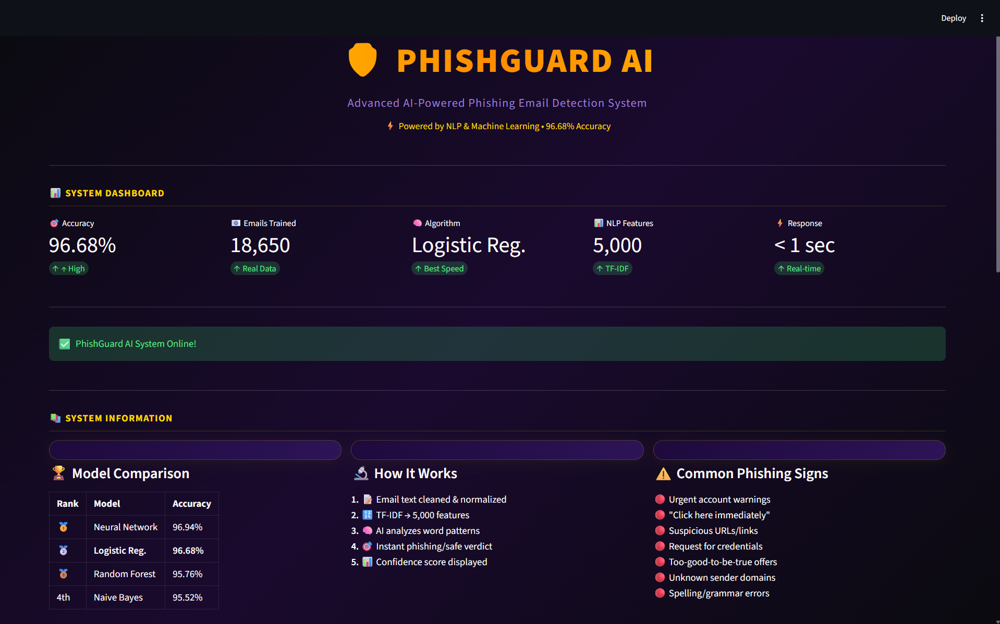
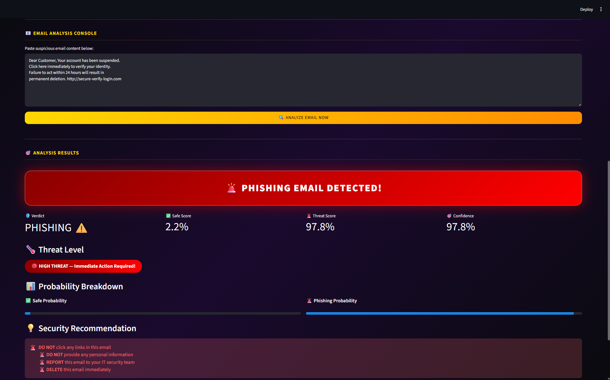
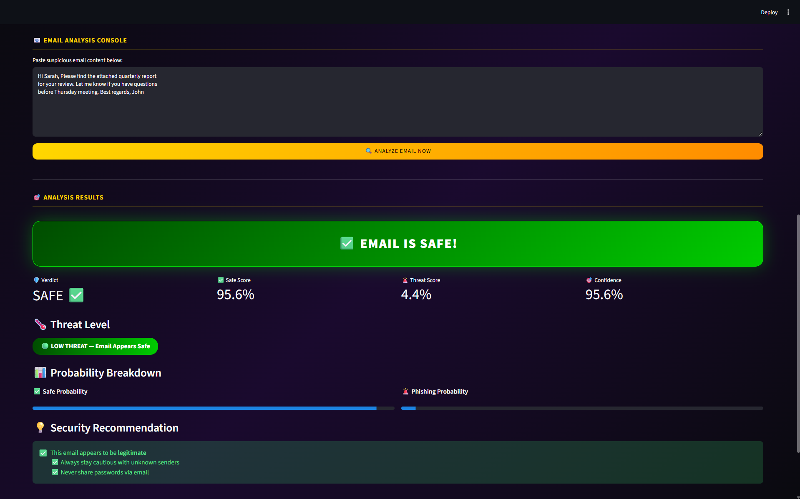

# 🛡️ PhishGuard AI — Phishing Email Detector

An AI-powered phishing email detection system built using NLP and Machine Learning. Instantly classifies emails as phishing or legitimate with confidence scoring.

---

## 🌐 Live Demo
[Click here to try PhishGuard AI](https://ai-driven-phishing-email-detection.streamlit.app/) 

---

## 📸 Screenshots

### Homepage


### Phishing Detected


### Safe Email


---

## 📊 Model Performance

| Rank | Model | Accuracy |
|------|-------|----------|
| 🥇 | Neural Network | 96.94% |
| 🥈 | **Logistic Regression** | **96.68%** |
| 🥉 | Random Forest | 95.76% |
| 4th | Naive Bayes | 95.52% |

> Logistic Regression selected for production — best balance of accuracy and speed.

---

## ✨ Features

- 🧠 **AI-Powered Detection** — Trained on 18,650 real emails
- 📊 **4 ML Models** — Naive Bayes, Logistic Regression, Random Forest, Neural Network
- 🌡️ **Threat Level** — High/Medium/Low threat classification
- 🎯 **Confidence Score** — Probability breakdown for each prediction
- 💡 **Security Recommendations** — Actionable advice based on verdict
- ⚡ **Instant Results** — Pre-trained model loads in under 1 second
- 🎨 **Premium UI** — Dark purple/gold dashboard design

---

## 🛠️ Technologies Used

- **Python** — Core programming language
- **Pandas & NumPy** — Data manipulation
- **NLTK** — Natural Language Processing
- **Scikit-learn** — Machine Learning models
- **TF-IDF** — Text feature extraction (5,000 features)
- **Joblib** — Model serialization
- **Streamlit** — Web application framework

---

## 🤖 ML & NLP Pipeline

**Text Preprocessing:**
- Lowercasing
- Punctuation removal
- Stopword removal
- Tokenization

**Feature Extraction:**
- TF-IDF Vectorization (5,000 features)

**Models Trained:**
- Naive Bayes (MultinomialNB)
- Logistic Regression
- Random Forest (50 estimators)
- Neural Network (MLP: 100→50 layers)

**Evaluation Metrics:**
- Accuracy
- Precision
- Recall
- F1-Score
- Confusion Matrix

---

## 📁 Project Structure

```
AI-Driven-Phishing-Email-Detection/
├── data/
│   └── phishing_email.csv
├── models/
│   ├── lr_model.pkl
│   └── tfidf.pkl
├── notebooks/
│   └── phishing_email_detection.ipynb
├── screenshots/
│   ├── app_homepage.png
│   ├── phishing_detected.png
│   └── safe_email.png
├── reports/
│   └── IEEE_Report.pdf
├── app.py
├── requirements.txt
└── README.md
```

---

## 🚀 How To Run Locally

**1. Clone the repository:**
```
git clone https://github.com/SHREYA-G-AMIN/AI-Driven-Phishing-Email-Detection
cd AI-Driven-Phishing-Email-Detection
```

**2. Install dependencies:**
```
pip install -r requirements.txt
```

**3. Download dataset:**
Download from [Kaggle](https://www.kaggle.com/datasets/subhajournal/phishingemails) and place in `data/` folder.

**4. Train and save model:**
Run all cells in `notebooks/phishing_email_detection.ipynb`

**5. Run the app:**
```
python -m streamlit run app.py
```

---

## 📈 Dataset

- **Source:** Kaggle — Phishing Email Detection by subhajournal
- **Total emails:** 18,650
- **Phishing emails:** 11,322 (60.7%)
- **Safe emails:** 7,328 (39.3%)
- **Note:** Imbalanced dataset — F1-Score used alongside accuracy

---

## ⚠️ Limitations

- Model trained on specific email dataset — may vary on different email styles
- Class imbalance (60/40) may affect performance on legitimate emails
- Does not analyze email attachments or embedded images

---

## 👩‍💻 Author

**Shreya G Amin**  
B.Tech Computer Science   
NMAM Institute of Technology, Nitte  

